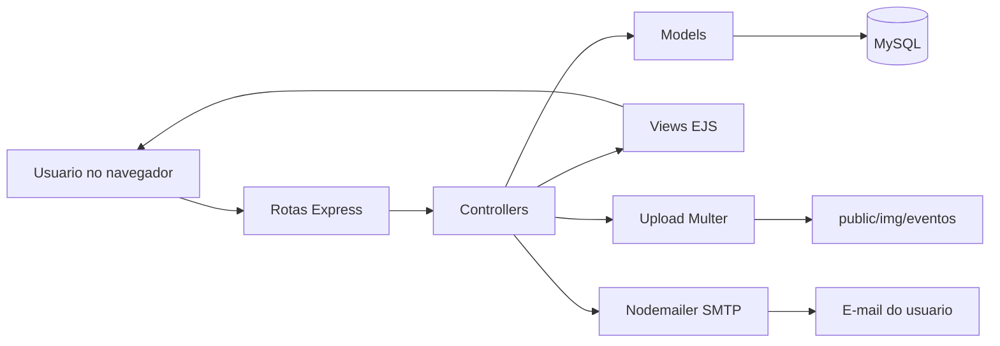
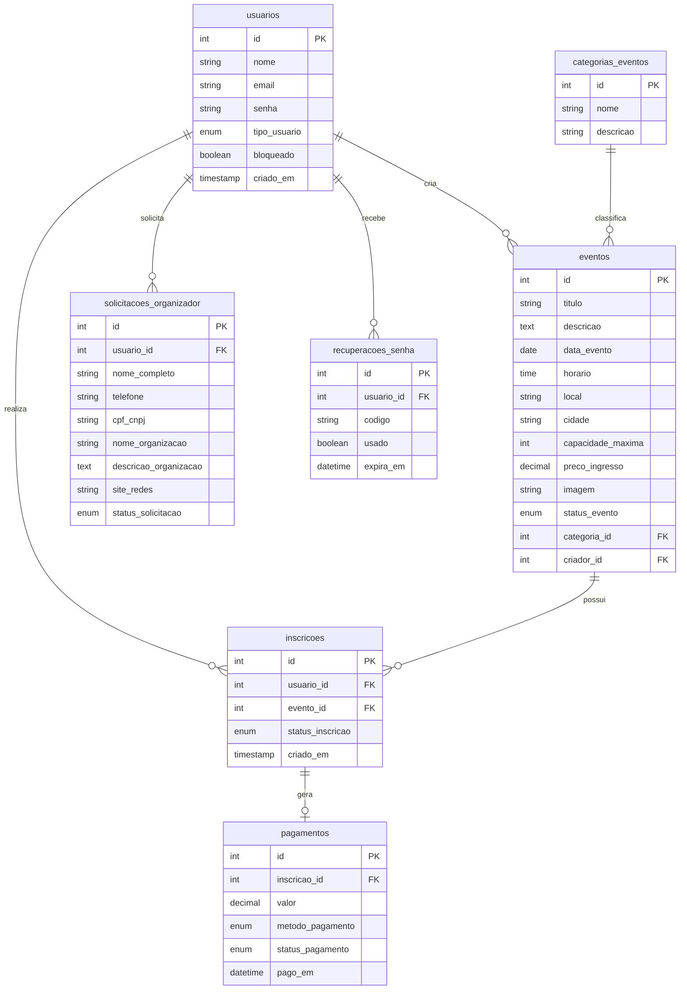
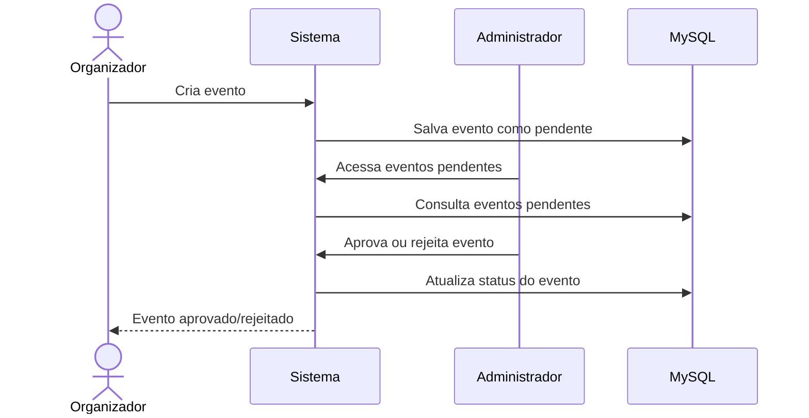
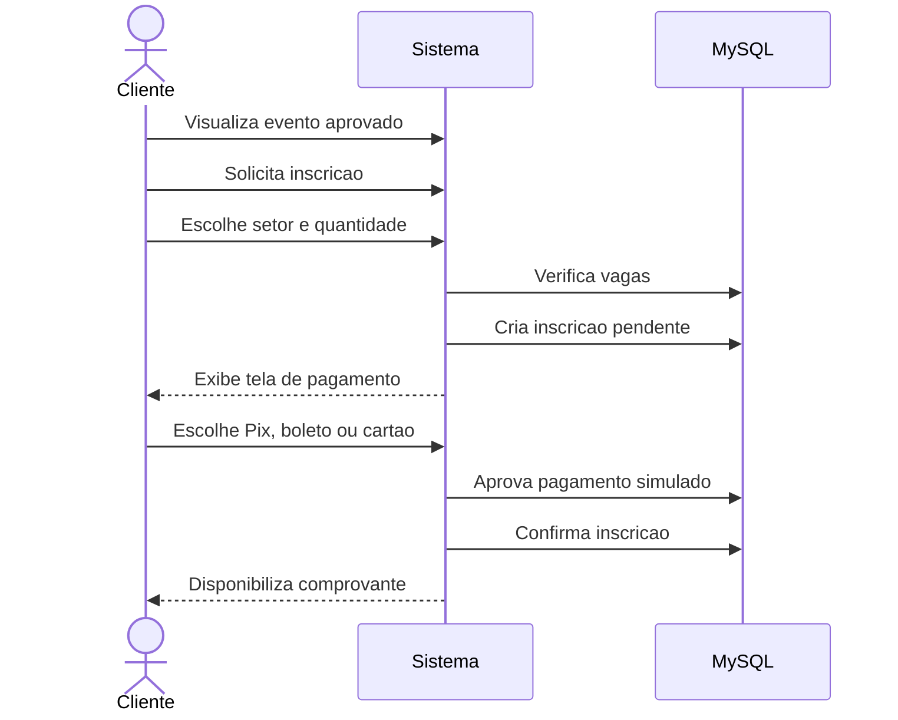
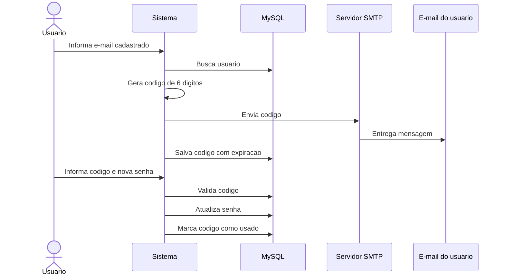

# Documentacao do Sistema Conecta Eventos

## 1. Visao geral

O **Conecta Eventos** e um sistema web academico para gestao de eventos, inscricoes e pagamentos simulados. A aplicacao foi desenvolvida com Node.js, Express, EJS, MySQL e Bootstrap.

O sistema permite que participantes encontrem eventos aprovados, realizem inscricoes, simulem pagamentos e emitam comprovantes. Organizadores podem solicitar permissao, criar eventos e acompanhar inscricoes. Administradores controlam usuarios, aprovam eventos e gerenciam solicitacoes.

## 2. Tecnologias utilizadas

- Node.js
- Express
- EJS
- MySQL
- Bootstrap
- express-session
- mysql2
- multer
- nodemailer
- method-override
- dotenv

## 3. Estrutura de pastas

```text
config/       Configuracoes de banco, upload e e-mail
controllers/  Regras das rotas e fluxos do sistema
models/       Consultas SQL e acesso ao banco
routes/       Definicao das rotas
views/        Telas EJS
public/       CSS, JS e imagens publicas
database/     Scripts SQL e scripts de migracao
docs/         Documentacao do projeto
```

## 4. Diagramas

### 4.1 Arquitetura geral



### 4.2 Casos de uso por perfil

```mermaid
flowchart TB
  Cliente["Cliente/participante"]
  Organizador["Organizador"]
  Admin["Administrador"]

  Cliente --> CU1["Criar conta e login"]
  Cliente --> CU2["Visualizar eventos aprovados"]
  Cliente --> CU3["Inscrever-se em eventos"]
  Cliente --> CU4["Pagar inscricao"]
  Cliente --> CU5["Emitir comprovante"]
  Cliente --> CU6["Solicitar perfil de organizador"]
  Cliente --> CU7["Recuperar senha"]

  Organizador --> OU1["Criar eventos pendentes"]
  Organizador --> OU2["Editar seus eventos"]
  Organizador --> OU3["Cancelar seus eventos"]
  Organizador --> OU4["Visualizar inscritos"]
  Organizador --> OU5["Consultar arrecadacao"]

  Admin --> AU1["Aprovar ou rejeitar eventos"]
  Admin --> AU2["Gerenciar usuarios"]
  Admin --> AU3["Bloquear usuarios"]
  Admin --> AU4["Aprovar organizadores"]
  Admin --> AU5["Visualizar dashboards"]
  Admin --> AU6["Editar qualquer evento"]
```



### 4.3 Modelo entidade-relacionamento



### 4.4 Fluxo de aprovacao de evento



### 4.5 Fluxo de inscricao e pagamento



### 4.6 Fluxo de recuperacao de senha



## 5. Perfis de usuario

### Cliente/participante

O cliente pode:

- criar conta;
- fazer login;
- visualizar eventos aprovados;
- pesquisar eventos;
- se inscrever em eventos;
- pagar inscricao/ingresso;
- visualizar minhas inscricoes;
- cancelar inscricao;
- emitir comprovante;
- solicitar perfil de organizador;
- recuperar senha por e-mail.

O cliente nao pode criar eventos.

### Organizador

O organizador pode:

- acessar dashboard proprio;
- criar eventos;
- criar setores com capacidade e valor proprio;
- editar apenas seus proprios eventos;
- cancelar seus proprios eventos;
- visualizar inscritos dos seus eventos;
- visualizar pagamentos vinculados aos seus eventos;
- pesquisar seus eventos por nome, cidade, local ou status.

Todo evento criado por organizador fica com status `pendente` ate aprovacao do administrador.

### Administrador

O administrador pode:

- acessar dashboard administrativo;
- aprovar eventos pendentes;
- rejeitar eventos;
- editar qualquer evento;
- excluir qualquer evento;
- gerenciar usuarios;
- alterar perfil de usuario;
- bloquear usuarios;
- aprovar ou rejeitar solicitacoes de organizador;
- pesquisar usuarios, eventos e solicitacoes;
- visualizar indicadores gerais do sistema.

## 6. Fluxo de eventos

### Criacao por organizador

1. Organizador acessa `/organizador/eventos/novo`.
2. Preenche os dados do evento e envia imagem.
3. O evento e salvo com status `pendente`.
4. O evento nao aparece na area publica.
5. Administrador acessa `/admin/eventos-pendentes`.
6. Administrador aprova ou rejeita.
7. Se aprovado, o evento aparece em `/eventos`.

### Criacao por administrador

1. Administrador acessa `/eventos/novo`.
2. Cria o evento.
3. O evento ja entra como `aprovado`.
4. O evento aparece publicamente.

## 7. Status dos eventos

| Status | Significado |
|---|---|
| pendente | Evento criado por organizador e aguardando analise |
| aprovado | Evento liberado para aparecer publicamente |
| rejeitado | Evento recusado pelo administrador |
| cancelado | Evento cancelado pelo organizador ou administrador |

Somente eventos com status `aprovado` aparecem na listagem publica.

## 8. Fluxo de solicitacao de organizador

1. Cliente acessa `/solicitar-organizador`.
2. O sistema usa automaticamente o nome cadastrado do usuario.
3. Cliente informa telefone, CPF/CNPJ, organizacao, descricao e site/redes.
4. A solicitacao fica com status `pendente`.
5. Administrador acessa `/admin/solicitacoes-organizador`.
6. Administrador aprova ou rejeita.
7. Se aprovado, o usuario passa a ter perfil `organizador`.

## 9. Fluxo de inscricao e pagamento

1. Cliente acessa `/eventos`.
2. Abre os detalhes do evento.
3. Clica em `Inscrever-se`.
4. O sistema verifica limite de vagas.
5. A inscricao e criada como `pendente`.
6. O cliente acessa a tela de pagamento.
7. Escolhe Pix, boleto ou cartao.
8. O sistema simula pagamento aprovado.
9. A inscricao passa para `confirmada`.
10. O cliente pode emitir comprovante.

### Pagamentos simulados

O sistema possui simulacao academica:

- Pix com QR Code e chave aleatoria;
- boleto com linha digitavel e codigo de barras ficticio;
- cartao com campos simulados de credito/debito.

Nenhuma cobranca real e realizada.

## 10. Recuperacao de senha

O sistema permite recuperacao por e-mail real usando SMTP.

Fluxo:

1. Usuario acessa `/esqueci-senha`.
2. Informa e-mail cadastrado.
3. Sistema gera codigo aleatorio de 6 digitos.
4. Sistema envia o codigo por e-mail.
5. Usuario acessa `/redefinir-senha`.
6. Informa e-mail, codigo e nova senha.
7. Codigo expira em 15 minutos e so pode ser usado uma vez.

Configuracao SMTP no `.env`:

```env
SMTP_HOST=smtp.gmail.com
SMTP_PORT=587
SMTP_SECURE=false
SMTP_USER=sistemaeventos2026@gmail.com
SMTP_PASS=sua_senha_de_app
SMTP_FROM=Conecta Eventos <sistemaeventos2026@gmail.com>
```

## 11. Banco de dados

Tabelas principais:

- `usuarios`
- `categorias_eventos`
- `eventos`
- `inscricoes`
- `pagamentos`
- `solicitacoes_organizador`
- `recuperacoes_senha`

### Relacionamentos

- Um usuario pode criar varios eventos.
- Um evento pertence a uma categoria.
- Um usuario pode se inscrever em varios eventos.
- Um evento pode ter varias inscricoes.
- Cada inscricao pode ter um pagamento.
- Um usuario pode ter solicitacoes para virar organizador.
- Um usuario pode ter codigos de recuperacao de senha.

## 12. Rotas principais

### Autenticacao

```text
GET  /login
POST /login
GET  /cadastro
POST /cadastro
POST /logout
GET  /esqueci-senha
POST /esqueci-senha
GET  /redefinir-senha
POST /redefinir-senha
```

### Publicas

```text
GET /eventos
GET /eventos/:id
GET /quem-somos
GET /contato
```

### Cliente

```text
GET  /minhas-inscricoes
GET  /inscricoes/minhas
POST /inscricoes/evento/:eventoId
PUT  /inscricoes/:id/cancelar
GET  /inscricoes/:id/comprovante
GET  /pagamento/:inscricaoId
POST /pagamento/:inscricaoId
GET  /solicitar-organizador
POST /solicitar-organizador
```

### Organizador

```text
GET  /organizador/dashboard
GET  /organizador/eventos
GET  /organizador/eventos/novo
POST /organizador/eventos
GET  /organizador/eventos/editar/:id
PUT  /organizador/eventos/:id
PUT  /organizador/eventos/:id/cancelar
GET  /organizador/eventos/:id/inscricoes
```

### Administrador

```text
GET    /admin/dashboard
GET    /admin/eventos
GET    /admin/eventos-pendentes
POST   /admin/aprovar-evento/:id
POST   /admin/rejeitar-evento/:id
GET    /admin/solicitacoes-organizador
POST   /admin/aprovar-organizador/:id
POST   /admin/rejeitar-organizador/:id
GET    /admin/usuarios
PUT    /admin/usuarios/:id
DELETE /admin/usuarios/:id
```

## 13. Seguranca

Recursos implementados:

- rotas privadas protegidas por sessao;
- controle de perfil por middleware;
- administrador separado de organizador e cliente;
- organizador so edita eventos proprios;
- usuarios bloqueados nao conseguem logar;
- consultas SQL com prepared statements;
- senha de recuperacao com codigo temporario;
- upload limitado a imagens;
- variaveis sensiveis no `.env`.

Observacao: por pedido academico, as senhas estao salvas em texto puro. Para uso real, recomenda-se reativar `bcrypt`.

## 14. Instalacao local

1. Instalar dependencias:

```bash
npm install
```

2. Configurar `.env`:

```env
DB_HOST=localhost
DB_PORT=3306
DB_USER=root
DB_PASSWORD=123456
DB_NAME=gestao_eventos
SESSION_SECRET=sistema-eventos-academico
PORT=3000
```

3. Importar banco local:

```bash
mysql -u root -p < database/schema.sql
```

4. Rodar:

```bash
npm start
```

5. Acessar:

```text
http://localhost:3000
```

## 15. Deploy no Railway

O projeto esta preparado para deploy no Railway.

Variaveis principais:

```env
DB_HOST=mysql.railway.internal
DB_PORT=3306
DB_USER=root
DB_PASSWORD=senha_do_railway
DB_NAME=railway
SESSION_SECRET=chave_segura
```

SQL para Railway:

```text
database/schema_railway.sql
```

Esse arquivo nao possui `CREATE DATABASE` nem `USE`, pois o Railway ja cria o banco.

## 16. Limitacoes conhecidas

- Upload de imagens no Railway usa disco local do container. Em producao real, recomenda-se Cloudinary, S3 ou storage externo.
- Pagamentos sao simulados.
- Senhas estao em texto puro por decisao academica temporaria.
- O sistema nao possui painel financeiro real nem gateway de pagamento.

## 17. Credenciais administrativas

O administrador pode ser criado de duas formas:

1. cadastrar um usuario comum e alterar o perfil no banco;
2. atualizar direto no MySQL:

```sql
UPDATE usuarios
SET tipo_usuario = 'administrador'
WHERE email = 'email_do_usuario';
```

## 18. Consideracoes finais

O Conecta Eventos cobre os principais requisitos de um sistema academico de gestao de eventos:

- autenticacao;
- perfis;
- aprovacao administrativa;
- eventos;
- inscricoes;
- pagamentos simulados;
- recuperacao de senha;
- dashboards;
- pesquisas;
- deploy online com banco MySQL.
